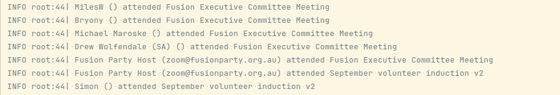

# Zoom Attendance
This programs serves to connect to a Zoom host's account, then list the recent meeting attendees:




## Installation
* You'll need to create an app yourself, using the same account that you'd like to monitor.
  This is because the review process is onerous: https://developers.zoom.us/docs/distribute/#app-submission-review--testing-process
  * Create your app by clicking **Build App** in the top-right at https://marketplace.zoom.us/ as per [Zoom's documentation](https://developers.zoom.us/docs/internal-apps/create/)
  * Ask for Server-to-Server OAuth authentication − this is the one that doesn't need
    end-user involvement (except when the end user has to create an app themselves).
  * Save your credentials in a file `credentials.env`:
    ```shell
    export ZOOM_ACCOUNT_ID="…"
    export ZOOM_CLIENT_ID="…"
    export ZOOM_CLIENT_SECRET="…"
    ```

## Execution
* Load the environment variables: `source credentials.env`
* Run the program: `python meeting_attendance.py`

## Development
* Clone this project
* Install Python
* [Optional] install virtualenv
* Install the requirements: `pip install --requirement requirements.txt`
* Install our pre-commit hook: `pre-commit install`
